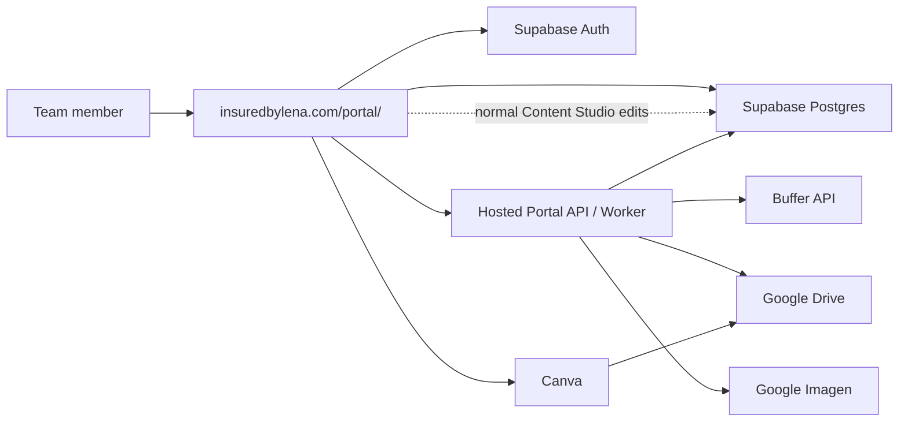

# Content Studio Remote Rollout

## Goal

Take `Content Studio` online inside `insuredbylena.com/portal/`, behind team login, so social media content can be created, reviewed, approved, scheduled, and published from remote locations.

This plan intentionally scopes the first online rollout to `Content Studio` only, instead of migrating the entire portal at once.

## Current Live State

The live direction is now:

- Content Studio editing uses Supabase directly from the browser
- portal login/session governs access
- publish is intentionally disabled in the browser until there is a proper server-side publisher
- Cloud Run is available for future worker/publisher responsibilities and any remaining backend endpoints

## Success Criteria

A remote portal user can:
- sign into `insuredbylena.com/portal/`
- open `7. Content Studio`
- view shared post records
- edit copy and Canva handoff fields
- upload or paste final asset URLs
- manage content status directly
- schedule posts
- trigger publish to Buffer
- see publish job history

An admin can:
- manage content statuses
- manage approvals
- run publishes
- see publish failures and audit history

## Recommended Architecture



## System Boundaries

### Browser / Portal frontend
Owns:
- login session handling
- content list and editor UI
- review queue UI
- status badges and publish flow guidance
- Canva handoff and design link storage
- direct Supabase Content Studio CRUD

Must not own:
- Buffer API keys
- Supabase service role key
- Google service credentials
- final publish authority

### Supabase
Owns:
- team authentication
- shared content records
- approvals, revisions, publish job logs
- row-level security

### Hosted API
Owns:
- privileged writes
- publish to Buffer
- integration with Drive / Imagen
- audit-safe mutations
- role-sensitive operations
- future worker jobs

## Why Content Studio First

Content Studio is the best first candidate because:
- it is already isolated as a tab inside the portal
- it already has a clear data model
- it is lower risk than leads/call desk scheduling
- the team value is immediate
- it does not require every other portal module to be production-ready

## Current State

### Already present in frontend
- Supabase client and auth gate in [app.js](/Users/hankybot/Documents/Playground/insuredbylena-site/portal/app.js)
- portal sign-in UI in [index.html](/Users/hankybot/Documents/Playground/insuredbylena-site/portal/index.html)
- Content Studio tab and workflow UI in [index.html](/Users/hankybot/Documents/Playground/insuredbylena-site/portal/index.html)

### Already present in database design
- `app_user_profile`
- `content_post`
- `content_revision`
- `content_approval`
- `content_publish_job`

Defined in:
- [supabase_schema.sql](/Users/hankybot/Documents/Playground/insuredbylena-site/portal/database/supabase_schema.sql)

### Already present in local backend
The local backend already models most required content actions. It should be adapted into a hosted API rather than rewritten from scratch.

## Phase Plan

## Phase 0: Scope Lock

### Decision
Take only `Content Studio` live first.

### Included
- auth
- content posts
- revisions
- approvals
- publish jobs
- Canva link / asset URL fields
- Buffer publishing

### Excluded for first deployment
- call desk
- Google Calendar scheduling
- lead import workflows
- carrier desk actions
- full CRM migration

## Phase 1: Supabase Foundation

### Tasks
1. Create or confirm the production Supabase project.
2. Run [supabase_schema.sql](/Users/hankybot/Documents/Playground/insuredbylena-site/portal/database/supabase_schema.sql).
3. Create the first team users in Supabase Auth.
4. Insert matching rows into `public.app_user_profile`.
5. Confirm the existing admin-only portal access rules continue to cover the content tables.
6. Rotate any previously exposed service-role credentials.

### Recommended initial roles
- `admin`

### Suggested access model
- Existing portal admin users can do everything in Content Studio.
- No separate editor or approver roles are required for the first remote rollout.
- Anyone who can log into the internal portal can work inside Content Studio under the existing admin model.

## Phase 2: Content Data Migration

### Tables to migrate first
1. `content_post`
2. `content_revision`
3. `content_approval`
4. `content_publish_job`

### Migration rules
- preserve IDs where practical if the frontend depends on them
- preserve `post_id`
- preserve `status`
- preserve `scheduled_for`
- preserve `scheduler_external_id`
- preserve audit timestamps where possible

### Important schema update
The current local app also uses `canva_design_link`, which should be added to production schema if it is not already present.

Add:
```sql
alter table public.content_post
add column if not exists canva_design_link text;
```

### Optional useful additions
```sql
alter table public.content_post
add column if not exists locked_by uuid references auth.users(id),
add column if not exists locked_at timestamptz,
add column if not exists design_status text default 'not_started';
```

## Phase 3: Hosted API / Worker

### Goal
Keep the hosted backend for privileged and server-side actions instead of normal Content Studio editing.

### Recommended runtime
- Python
- small VPS or lightweight container host
- keep service keys server-side only

### Server-side endpoints still worth keeping
- `GET /api/content/posts`
- `GET /api/content/publish/jobs`
- `POST /api/content/posts/import-buffer-current`
- `POST /api/content/publish/run`
- `GET /api/content/publisher/status`

### Responsibilities of API
- validate portal session/admin access where needed
- run server-side publish jobs
- call Buffer API
- write back publish results
- handle worker-style integrations that should not live in the browser

### Security rule
- browser uses Supabase session token
- API verifies that token against the same admin access model already used by the portal
- API uses `SUPABASE_SERVICE_ROLE_KEY` only server-side

## Phase 4: Frontend Productionization

### Goal
Make `portal/app.js` use hosted production endpoints cleanly for Content Studio.

### Frontend tasks
1. Keep Supabase login gate as the outer app login.
2. Replace any remaining non-Supabase local assumptions with the production API base where still needed.
3. Ensure Content Studio only loads after authenticated session.
4. Keep Content Studio permissions aligned with the existing portal admin login model.
5. Keep stable runtime config via `window.PORTAL_CONFIG`.

### `PORTAL_CONFIG` should provide
- `supabaseUrl`
- `supabasePublishableKey`
- `apiBase`

### Content Studio UI improvements for remote use
- show active user email
- show last edited at
- show current editor/lock if another person is editing
- show clear status progression:
  - Draft
  - Needs Design
  - Ready for Approval
  - Approved
  - Scheduled
  - Published

## Phase 5: Publishing and Asset Flow

### Recommended production workflow
1. Portal user updates copy in Content Studio
2. Portal user stores Canva design link
3. Final Canva export URL is saved in Content Studio
4. Portal user approves or updates status directly
5. Schedule is set
6. Hosted worker/API publishes to Buffer
7. API logs result into `content_publish_job`

### Asset strategy
- Google Drive = durable storage
- Canva = final text/layout
- Buffer = publisher
- Imagen = optional source visual generation, server-side only

### Required validation before publish
- authenticated session
- role allows publish
- post has final asset URL
- post is approved or scheduled
- required schedule exists if scheduling mode is used

## Phase 6: Remote Collaboration Features

### Must-have collaboration behaviors
- revision history per post
- approval history per post
- visible current status
- clear publish job log

### Strongly recommended next features
- optimistic locking or edit lease
- `locked_by` indicator
- comment thread per post
- filter by owner / status / lock state
- notification when review is requested

## Implementation Checklist

## Backend
- [ ] extract content routes from local backend into hosted service
- [ ] add Supabase session verification middleware
- [ ] add role authorization helpers
- [ ] add `canva_design_link` support in production schema
- [ ] implement publish-to-Buffer endpoint
- [ ] write publish job audit logging
- [ ] add health/status endpoint

## Database
- [ ] run schema in production Supabase
- [ ] add missing `canva_design_link` column
- [ ] migrate Content Studio data from SQLite
- [ ] confirm existing portal admin users can access content tables
- [ ] validate admin-only RLS policies

## Frontend
- [ ] set production `PORTAL_CONFIG`
- [ ] confirm login gate works remotely
- [ ] point Content Studio actions to hosted API
- [ ] keep Content Studio aligned with existing portal admin access
- [ ] show publish errors clearly
- [ ] add collaboration status display

## Operations
- [ ] rotate keys
- [ ] document user onboarding
- [ ] document publish runbook
- [ ] test remote access from a non-local machine
- [ ] test approval and publish with two different users

## Exact Files Likely To Change

### Frontend
- [index.html](/Users/hankybot/Documents/Playground/insuredbylena-site/portal/index.html)
- [app.js](/Users/hankybot/Documents/Playground/insuredbylena-site/portal/app.js)
- [styles.css](/Users/hankybot/Documents/Playground/insuredbylena-site/portal/styles.css)

### Backend
- [local_db_api.py](/Users/hankybot/Documents/Playground/insuredbylena-site/portal/database/local_db_api.py)
- [supabase_schema.sql](/Users/hankybot/Documents/Playground/insuredbylena-site/portal/database/supabase_schema.sql)
- [/.env.example](/Users/hankybot/Documents/Playground/insuredbylena-site/portal/database/.env.example)

## Recommended Build Order

1. Supabase schema and auth setup
2. Add missing production content fields like `canva_design_link`
3. Migrate Content Studio data from SQLite
4. Deploy hosted API for content endpoints only
5. Switch Content Studio frontend to production API base
6. Test with admin account
7. Test remote collaboration from a second location/device
8. Turn on real Buffer publishing
9. Add locking and collaboration polish

## Risks And Mitigations

### Risk: mixed local and hosted data paths
Mitigation:
- force Content Studio to use one production path only once switched

### Risk: exposed privileged credentials
Mitigation:
- keep all Buffer and service-role keys in hosted API only

### Risk: concurrent editing conflicts
Mitigation:
- add soft locking and revision history early

### Risk: confusing access behavior
Mitigation:
- keep Content Studio on the same portal admin model and enforce it again on the API

## Recommended First Milestone

### Milestone name
`Content Studio Remote Beta`

### Definition
A small internal team can log into `insuredbylena.com/portal/`, edit shared posts, add Canva links and asset URLs, approve, schedule, and log publish attempts remotely.

### Not required for this milestone
- full CRM migration
- public automation intake replacement
- Google Calendar parity
- full portal production hardening outside Content Studio

## Suggested Immediate Next Step

Build the production slice for only these tables and flows:
- `content_post`
- `content_revision`
- `content_approval`
- `content_publish_job`

That gives the fastest path to remote content production without overcommitting the whole portal migration.
